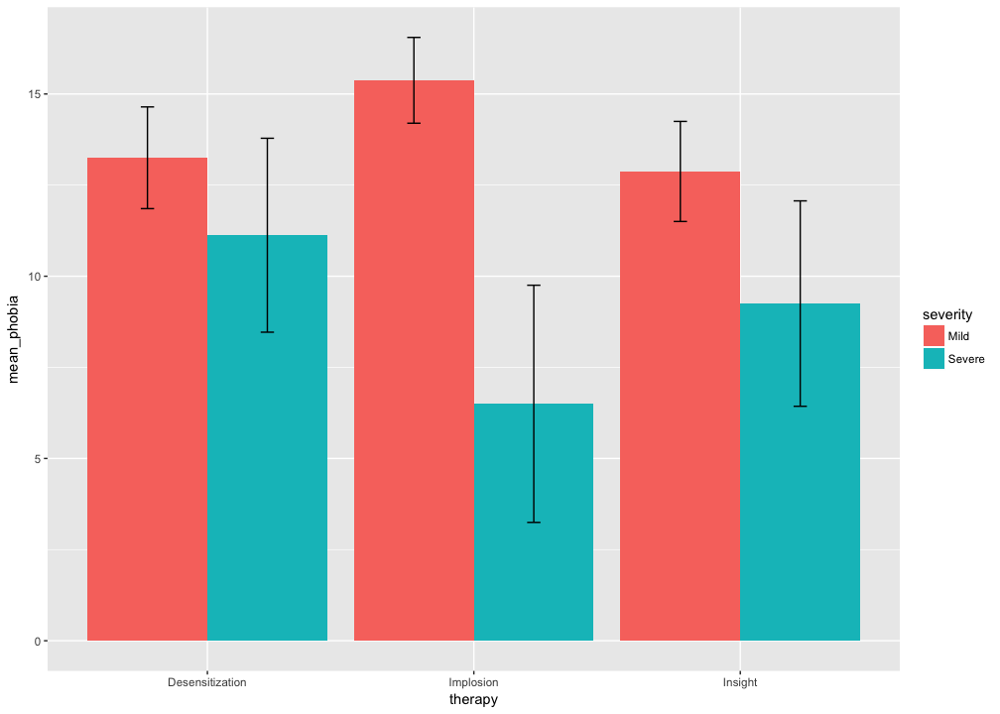
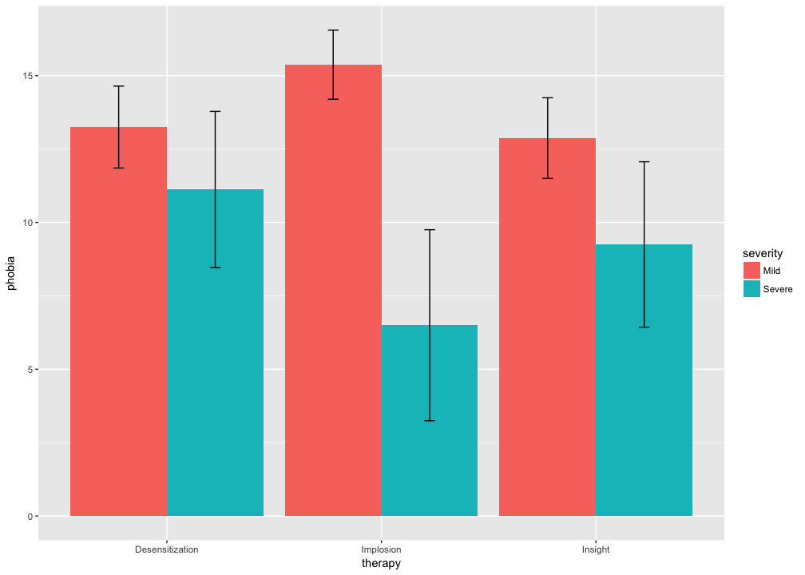
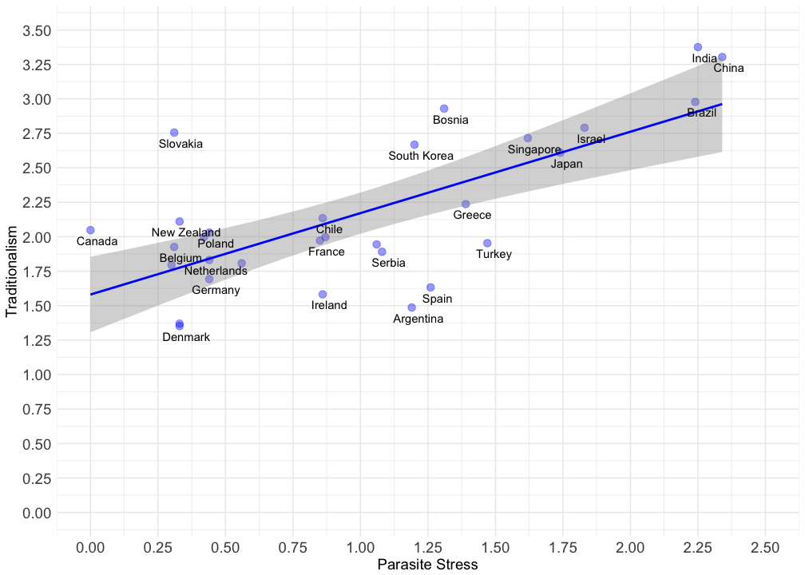
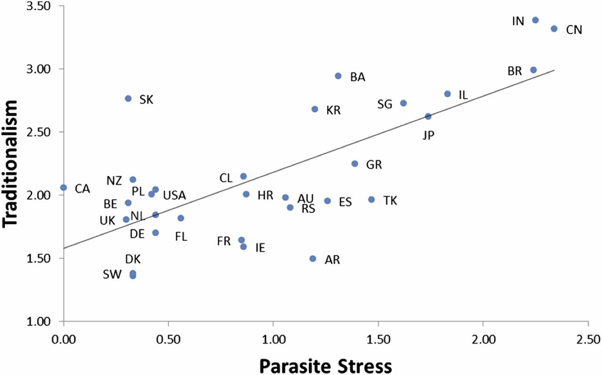

# Day 1. Data import and Data Visualization
Nicholas Michalak  
6/25/2017  

# install prerequisite packages


```r
# character vector of packages you'll need for your whole analysis
needed_packages <- c("tidyverse", "haven")

# source custom function
source("custom_functions/install_needed_pkgs.R")

# install needed packages
install_needed_pkgs(needed_packages = needed_packages)
```

```
## Loading tidyverse: ggplot2
## Loading tidyverse: tibble
## Loading tidyverse: tidyr
## Loading tidyverse: readr
## Loading tidyverse: purrr
## Loading tidyverse: dplyr
```

```
## Conflicts with tidy packages ----------------------------------------------
```

```
## filter(): dplyr, stats
## lag():    dplyr, stats
```

```
## [[1]]
##  [1] "dplyr"     "purrr"     "readr"     "tidyr"     "tibble"   
##  [6] "ggplot2"   "tidyverse" "stats"     "graphics"  "grDevices"
## [11] "utils"     "datasets"  "methods"   "base"     
## 
## [[2]]
##  [1] "haven"     "dplyr"     "purrr"     "readr"     "tidyr"    
##  [6] "tibble"    "ggplot2"   "tidyverse" "stats"     "graphics" 
## [11] "grDevices" "utils"     "datasets"  "methods"   "base"
```

# psychology example 1

> (Adapted from Maxwell & Delaney, 1990, p 300, quest #9) A clinical psychologist wants to compare three types of therapy for snake phobia. However, she does not believe that one type of therapy is necessarily best for everyone; the best therapy may depend on the severity level of the client's phobia. Undergraduate students enrolled in an introductory psychology course were given a Fear Inventory to screen out subjects showing no fear of snakes. Those displaying some degree of snake phobia were classified as either mildly or severely phobic. Subjects were then randomly assigned to one of three treatment conditions: systematic desensitization, implosive therapy, or insight therapy. The following data are from a well-accepted phobia scale (higher scores indicate less phobia). You don't need to know anything about the conceptual differences between these three therapies or the phobia scale to answer the following questions. To save time, no need to check assumptions for this problem set but don't skip this step when you analyze real data in your research.


```r
# source example data
source("example_tidy_data/snake_phobia.R")

# view descriptives for snake therapy data
snk_thrpy_desc
```

```
## # A tibble: 6 x 8
## # Groups:   therapy [?]
##           therapy severity n_cell mean_phobia sd_phobia se_phobia   t_crit
##             <chr>    <chr>  <int>       <dbl>     <dbl>     <dbl>    <dbl>
## 1 Desensitization     Mild      8      13.250  1.669046 0.5900968 2.364624
## 2 Desensitization   Severe      8      11.125  3.181981 1.1250000 2.364624
## 3       Implosion     Mild      8      15.375  1.407886 0.4977629 2.364624
## 4       Implosion   Severe      8       6.500  3.891382 1.3758114 2.364624
## 5         Insight     Mild      8      12.875  1.642081 0.5805632 2.364624
## 6         Insight   Severe      8       9.250  3.370036 1.1914877 2.364624
## # ... with 1 more variables: moe_phobia <dbl>
```

## plot means from table of descriptives


```r
ggplot(data = snk_thrpy_desc, aes(x = therapy, y = mean_phobia, fill = severity)) +
  geom_bar(stat = "identity", position = position_dodge(width = 0.9)) +
  geom_errorbar(mapping = aes(ymin = mean_phobia - moe_phobia, ymax = mean_phobia + moe_phobia), position = position_dodge(width = 0.9), width = 0.1)
```

<!-- -->

## plot means from raw data


```r
ggplot(data = snakes_therapy, aes(x = therapy, y = phobia, fill = severity)) +
  stat_summary(fun.data = "mean_cl_normal", geom = "bar", position = position_dodge(width = 0.9)) +
  stat_summary(fun.data = "mean_cl_normal", geom = "errorbar", position = position_dodge(width = 0.9), width = 0.1)
```

<!-- -->

# psychology example 2

> adapted from figure 1 from Tybur et al. (2016)

* The scatterplot displays the relationship between national parasite stress and traditionalism (r = 0.70). Each data point [labeled with a two-letter country code (abbreviations defined in Table 1)] represents a nation's mean traditionalism, controlling for sample demographic characteristics (age and sex).
* To facilitate visual interpretation of results (Figs. 1–3), we added a constant to each nation’s parasite stress score so that the lowest scoring country (Canada) had a value of zero.


```r
# source example data
source("example_tidy_data/tybur_et_al_fig_1.R")
```

```
## Warning: Column `country` has different attributes on LHS and RHS of join
```

```r
# view data for plot
tybur_et_al_fig1
```

```
## # A tibble: 30 x 4
## # Groups:   country [30]
##        country histpath traditionalism hist_path_rscld
##         <fctr>    <dbl>          <dbl>           <dbl>
##  1      Israel     0.52       2.790726            1.83
##  2   Singapore     0.31       2.715984            1.62
##  3     Belgium    -1.00       1.926433            0.31
##  4      Serbia    -0.23       1.890731            1.08
##  5       Spain    -0.05       1.632627            1.26
##  6   Australia    -0.25       1.944385            1.06
##  7    Slovakia    -1.00       2.755881            0.31
##  8      France    -0.46       1.972309            0.85
##  9 New Zealand    -0.98       2.110723            0.33
## 10     Denmark    -0.98       1.352026            0.33
## # ... with 20 more rows
```

## scatterplot with 95% confidence ribbons country labels


```r
ggplot(data = tybur_et_al_fig1, aes(x = hist_path_rscld, y = traditionalism, label = country)) +
  geom_point(size = 3, alpha = 0.4, color = "blue") +
  geom_smooth(method = "lm", color = "blue") +
  scale_x_continuous(breaks = seq(0, 2.5, 0.25), limits = c(0, 2.5)) +
  scale_y_continuous(breaks = seq(0, 3.5, 0.25), limits = c(0, 3.5)) +
  geom_text(check_overlap = TRUE, nudge_x = 0.025, nudge_y = -0.075) +
  labs(x = "Parasite Stress", y = "Traditionalism") +
  theme_minimal() +
  theme(axis.title.x = element_text(size = 14),
        axis.text.x = element_text(size = 14),
        axis.title.y = element_text(size = 14),
        axis.text.y = element_text(size = 14))
```

<!-- -->

## compare this to published figure


